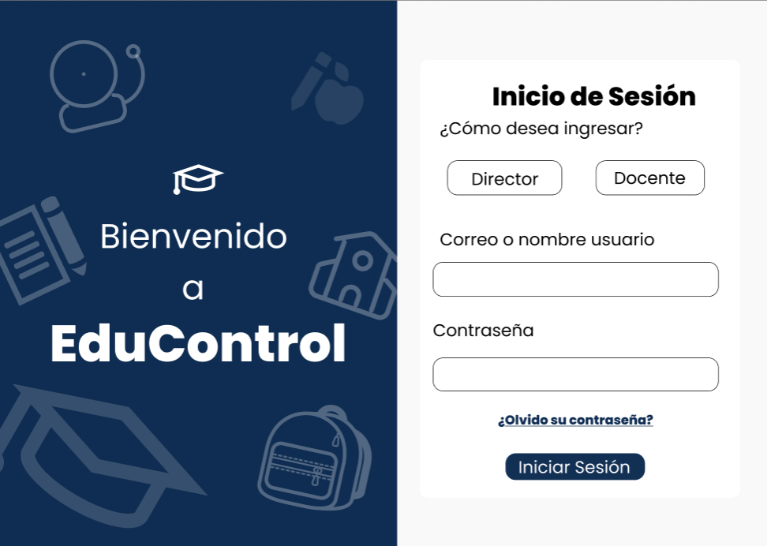
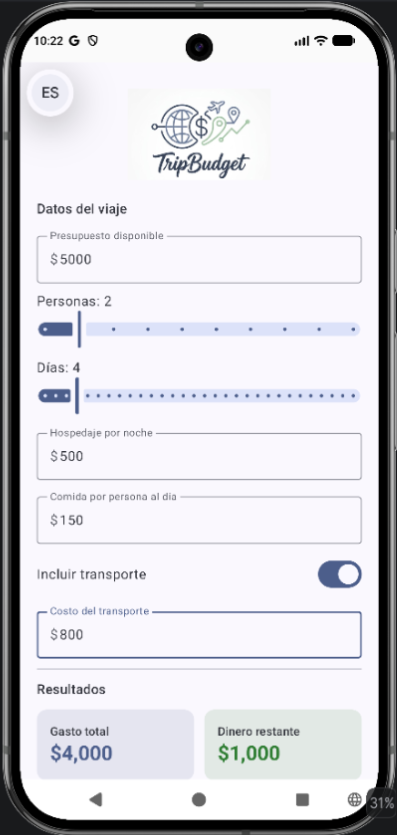
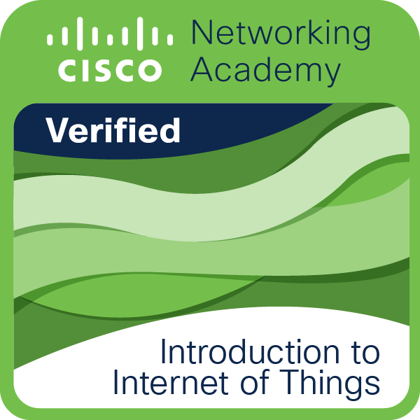
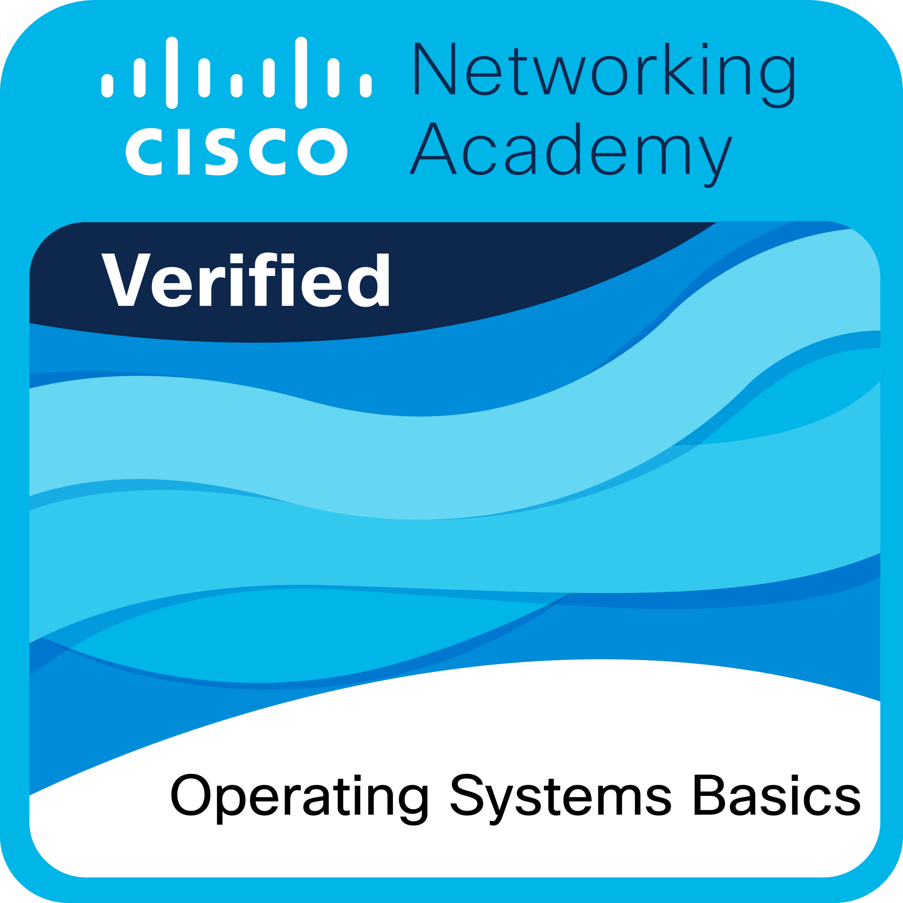

```{=html}
<main class="portfolio" id="inicio">
  <header class="site-header">
    <a class="brand" href="#inicio" aria-label="Lali, inicio">✦</a>
    <nav class="nav-pills" aria-label="Navegación principal">
      <a class="active" href="#inicio">ME</a><a href="#inicio">HOME</a><a href="#sobre-mi">ABOUT</a><a href="#skills">SKILLS</a><a href="#proyectos">PROJECTS</a><a href="#contacto">CONTACT</a>
    </nav>
    <a class="button button-small" href="#contacto">Hire Me</a>
  </header>

  <section class="hero">
    <div class="hero-copy">
      <p class="eyebrow">Estudiante de Ingeniería en Tecnologías de la Información e Innovación Digital</p>
      <h1>Hola! Soy <span>Citlali</span></h1>
      <h2 class="hero-role">Software Developer · Frontend · Creative Mind</h2>
      <p class="hero-intro">Transformo ideas en experiencias digitales que combinan código, diseño y creatividad.</p>
      <div class="button-row"><a class="button" href="#sobre-mi">CONOCERME</a><a class="button button-outline" href="#proyectos">VER PROYECTOS</a></div>
      <div class="terminal"><div class="terminal-top"><span></span><span></span><span></span><small>bash</small></div><p><b>$ whoami</b></p><p>&gt; Lali.exe</p><p>Frontend Developer · Creative thinker</p><p>Student @ UPChiapas · Always learning</p></div>
    </div>
    <div class="portrait-frame"><div class="portrait-label">CITLALI MONTSERRAT ALVARADO <span>✦</span></div><div class="portrait-placeholder"><span class="portrait-spark">✿</span></div><div class="portrait-bottom"><span>LALI</span><span>UPCHIAPAS</span></div></div>
  </section>

  <section class="section about" id="sobre-mi">
    <div class="section-heading"><span class="flower">🌸</span><div><h2>Sobre mí</h2><p>Conoce a la persona detrás del código.</p></div></div>
    <div class="about-grid"><div class="orb-card"><div class="orb">☾</div><span class="orb-caption">CREATIVIDAD · CURIOSIDAD · CÓDIGO</span></div><div class="about-copy"><p>Soy <strong>Citlali Montserrat</strong>, aunque prefiero que me llamen <strong>Lali</strong>. Tengo 19 años y estudio Ingeniería en Tecnologías de la Información e Innovación Digital en la Universidad Politécnica de Chiapas.</p><p>Soy una persona muy responsable, creativa y curiosa. Me gusta aprender, experimentar y encontrar formas de convertir una idea en algo que realmente funcione.</p><p>Mi camino dentro de la tecnología todavía está en construcción. Estoy explorando áreas del software, con especial interés en el frontend y la creación de interfaces.</p></div></div>
    <div class="facts-grid profile-facts"><div><strong>19</strong><small>AÑOS</small></div><div><strong>4.º</strong><small>CUATRIMESTRE</small></div><div><strong>CHIAPAS</strong><small>MÉXICO</small></div><div><strong>ESTUDIANTE</strong><small>UPCHIAPAS</small></div></div>
  </section>

  <section class="section" id="hobbies"><div class="section-title"><h2>Hobbies</h2></div><div class="hobby-grid"><article class="mini-card"><span>🎨</span><h3>DIBUJAR</h3><p>Me gusta dibujar, pintar y experimentar estilos.</p></article><article class="mini-card"><span>🌈</span><h3>COLORES</h3><p>Una de las partes que más disfruto al crear.</p></article><article class="mini-card"><span>✂️</span><h3>MANUALIDADES</h3><p>Crear cosas físicas con diferentes materiales.</p></article><article class="mini-card"><span>🎧</span><h3>MÚSICA</h3><p>Un buen soundtrack hace llevadero todo proyecto.</p></article><article class="mini-card"><span>📚</span><h3>APRENDER</h3><p>Siempre hay algo nuevo que quiero descubrir.</p></article><article class="mini-card"><span>💻</span><h3>CREAR</h3><p>Convertir ideas simples en proyectos reales.</p></article></div><div class="quote-bar">“La creatividad también es una forma de resolver problemas.”</div></section>

  <section class="section" id="que-hago"><div class="section-title"><h2>Lo que hago</h2><p>Donde las ideas empiezan a convertirse en productos digitales.</p></div><div class="service-list"><article><b>01</b><div><h3>FRONTEND DEVELOPMENT</h3><p>Creo interfaces web enfocadas en que sean claras, funcionales y visualmente atractivas.</p></div></article><article><b>02</b><div><h3>UI / INTERFACES</h3><p>Me interesa especialmente cómo se ve y cómo se siente una aplicación al usarla.</p></div></article><article><b>03</b><div><h3>DESARROLLO DE APLICACIONES</h3><p>Trabajo con proyectos móviles utilizando Kotlin y Jetpack Compose.</p></div></article><article><b>04</b><div><h3>RESOLUCIÓN DE PROBLEMAS</h3><p>Me gusta dividir problemas grandes en partes pequeñas y encontrar soluciones paso a paso.</p></div></article><article><b>05</b><div><h3>DISEÑO + TECNOLOGÍA</h3><p>Me interesa ese punto de encuentro entre la creatividad, la estética y el código.</p></div></article></div></section>

  <section class="section" id="skills"><div class="section-title"><h2>Skills</h2><p>Lo que estoy aprendiendo y construyendo.</p></div><div class="skills-grid"><article class="skill-card"><h3>DESARROLLO</h3><div class="meter"><span style="--level:88%">HTML / CSS</span></div><div class="meter"><span style="--level:70%">JavaScript</span></div><div class="meter"><span style="--level:60%">React</span></div><div class="meter"><span style="--level:78%">Kotlin / Java</span></div></article><article class="skill-card"><h3>HERRAMIENTAS</h3><ul><li>Git / GitHub</li><li>VS Code</li><li>Android Studio</li><li>Figma</li></ul></article><article class="skill-card"><h3>CONOCIMIENTOS</h3><ul><li>Responsive Design</li><li>UI / UX Basics</li><li>Desarrollo Móvil</li><li>Estructuras de Datos</li><li>Bases de Datos</li><li>Linux / Redes</li></ul></article></div><div class="learning-card"><h3>RADAR DE APRENDIZAJE</h3><div class="radar"><span>Frontend</span><span>Creatividad</span><span>Trabajo en equipo</span><span>Lógica</span><span>UI / Diseño</span></div><div class="learning-note"><i>“Siempre aprendiendo<br>algo nuevo.”</i> <span>✦</span></div></div></section>

  <section class="section" id="toolbox"><div class="section-title"><h2>My toolbox</h2><p>Badges &amp; Chips</p></div><div class="tool-tags"><span>HTML5</span><span>CSS3</span><span>JavaScript</span><span class="pink-tag">React</span><span>Kotlin</span><span>Jetpack Compose</span><span>Java</span><span>Git</span><span class="pink-tag">GitHub</span><span>Figma</span><span>VS Code</span><span>Android Studio</span><span>Python</span><span>C++</span><span>C</span></div></section>

  <section class="section" id="proyectos"><div class="section-title"><h2>Proyectos</h2><p>Algunas cosas que he construido siendo estudiante.</p></div><div class="project-list"><article class="project-card"><div class="project-preview preview-one"></div><div class="project-copy"><p class="project-index">01 / ACADÉMICO</p><h3>EduControl</h3><p>Sistema de gestión académica pensado para facilitar el registro y seguimiento escolar en educación primaria.</p><p class="project-role"><strong>ROL:</strong> Frontend / desarrollo</p><div class="tag-row"><span>Java</span><span>UI</span><span>Data</span></div></div></article><article class="project-card"><div class="project-preview preview-two"></div><div class="project-copy"><p class="project-index">02 / MÓVIL</p><h3>Trip Budget</h3><p>Calculadora de presupuesto para viajes desarrollada como aplicación móvil. Permite gestionar hospedaje, transporte y actividades.</p><p class="project-role"><strong>TECNOLOGÍAS:</strong></p><div class="tag-row"><span>Kotlin</span><span>Jetpack Compose</span></div></div></article></div><div class="build-status"><b>Currently building...</b><small>Este espacio seguirá creciendo conmigo. ✦</small></div></section>

  <section class="section" id="journey"><div class="section-title"><h2>My journey</h2><p>Línea de tiempo de mi aprendizaje.</p></div><div class="timeline"><article><time>2025</time><div><p>Inicio de Ingeniería en Tecnologías en Información e Innovación Digital en UPChiapas.</p></div></article><article><time>2026</time><div><p>Primeros proyectos académicos y Java con estructuras de datos.</p></div></article><article><time>2026</time><div><p>Exploración de Desarrollo Móvil con Kotlin y Jetpack Compose.</p></div></article><article><time>2026</time><div><p>Especialización inicial en Desarrollo Web Frontend y React.</p></div></article><article><time>FUTURO</time><div><p><i>Construyendo proyectos cada vez más grandes...</i></p></div></article></div></section>

  <section class="section" id="certificaciones"><div class="section-title"><h2>Certificaciones</h2><p>Cada curso es una pieza más de mi camino.</p></div><div class="cert-grid"><article><h3>Graduado de la Academia AWS – Fundamentos de la Nube – Insignia de Capacitación</h3><p>Adquirí mayor conocimiento en arquitectura de la nube y sus servicios.</p><small>Amazon Web Services · 27 de noviembre de 2025</small></article><article><h3>Introducción al IoT</h3><p>Comprendí de mejor manera el internet de las cosas y cómo aplicarlo.</p><small>Cisco · 19 de noviembre de 2025</small></article><article><h3>Conceptos básicos de los sistemas operativos</h3><p>Aprendí más sobre sistemas operativos y cómo se utilizan.</p><small>Cisco · 17 de febrero de 2026</small></article></div><div class="quote-bar learning-banner">🌱 &nbsp; <strong>Actualmente aprendiendo:</strong><br>Profundizando en React Hooks, Animaciones en CSS y patrones de diseño UI móvil con Android Developer.</div><a class="credly-link" href="https://www.credly.com/users/citlali-montserrat-alvarado-perez" target="_blank" rel="noopener noreferrer"><span>✦</span> VERIFICAR MIS CURSOS E INSIGNIAS EN CREDLY <b>↗</b></a></section>

  <section class="section" id="quick-facts"><div class="section-title"><h2>Quick facts</h2><p>Un dashboard personal express.</p></div><div class="facts-grid quick-facts"><div><strong>19</strong><small>años</small></div><div><strong>4</strong><small>cuatrimestre</small></div><div><strong>∞</strong><small>curiosidad</small></div><div><strong>🎨</strong><small>creatividad</small></div><div><strong>💻</strong><small>código</small></div></div><div class="learning-card"><h3>CURRENTLY LEARNING &amp; EXPLORING</h3><p>✦ Frontend &nbsp; ✦ React &nbsp; ✦ Kotlin &nbsp; ✦ UI Design &nbsp; ✦ Mobile Development</p></div></section>

  <section class="section" id="contacto"><div class="section-title"><h2>Let's connect</h2><p>También puedes encontrarme por aquí.</p></div><div class="social-grid"><a href="https://github.com/CitlaliAl?tab=repositories" target="_blank" rel="noopener noreferrer"><span>GitHub</span><small>@CitlaliAl</small><i>↗</i></a><a href="https://www.instagram.com/laliverse.zip/" target="_blank" rel="noopener noreferrer"><span>Instagram</span><small>@laliverse.zip</small><i>↗</i></a><a href="https://linkedin.com/in/citlali-montserrat-alvarado-9343483b7" target="_blank" rel="noopener noreferrer"><span>LinkedIn</span><small>Citlali Montserrat Alvarado</small><i>↗</i></a></div></section>

  <section class="section contact-section"><div class="section-title"><h2>¿Hacemos algo juntos?</h2><p>Si tienes una idea, proyecto o simplemente quieres decir hola, escríbeme.</p></div><div class="contact-layout"><form class="contact-form" action="mailto:253394@it2id.upchiapas.edu.mx" method="post" enctype="text/plain"><label for="name">NOMBRE</label><input id="name" name="Nombre" placeholder="Tu nombre" required><label for="email">CORREO</label><input id="email" name="Correo" type="email" placeholder="tu@email.com" required><label for="message">MENSAJE</label><textarea id="message" name="Mensaje" placeholder="Cuéntame un poquito..." rows="4" required></textarea><button class="button" type="submit">ENVIAR MENSAJE ✦</button></form></div></section>

  <blockquote class="closing-quote">“Todavía estoy aprendiendo.<br>Todavía estoy creando.<br>Y todavía tengo muchísimo por construir.”<cite>Lali <span>✦</span></cite></blockquote>
  <footer class="site-footer"><a class="brand" href="#inicio">LALI ✦</a><p>Software Developer · Frontend · Creative Mind</p><p>Designed &amp; developed with ♡</p><small>© 2026 — Lali ✦</small></footer>
</main>
```
